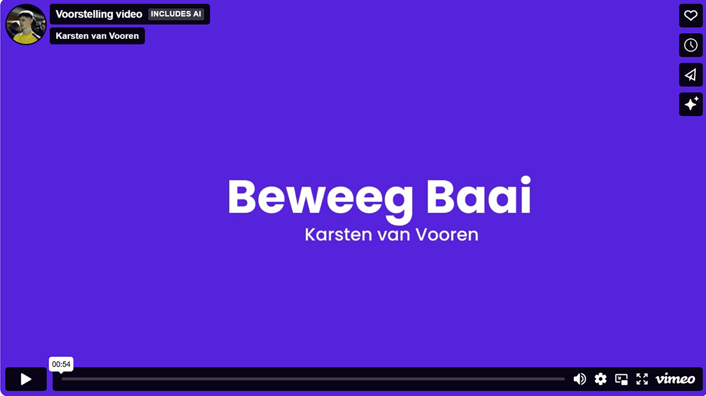

# BeweegBaai

Interactieve installatie die je **handbeweging** vertaalt naar een **horizontale golf** en **muziek**.  
- **Links** op het scherm = **piano** 🎹  
- **Rechts** op het scherm = **viool** 🎻  
- **Hoogte** van je hand = toonhoogte.  
- Alles draait **lokaal** in de browser via **MediaPipe Hands** (webcam) en **Tone.js** (samples).

---

## Demo-video
  
*(Komt op het einde — voeg je YouTube/Vimeo-link hier in en zet een thumbnailafbeelding in `media/thumbnail.png`.)*

---

## 📦 Repo-structuur

